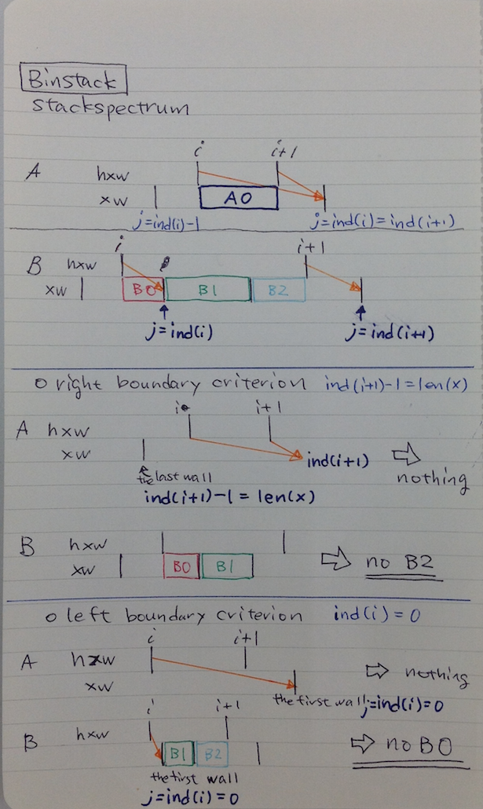

# ChopStacks

Small python code for flux-preserving resampling and stacking of 1D data.

* re-sampling 1D data and preserving flux with an arbitrary array
* stacking 1D data with preserving flux
* converting the 1D data into the log 1D data with preserving flux

